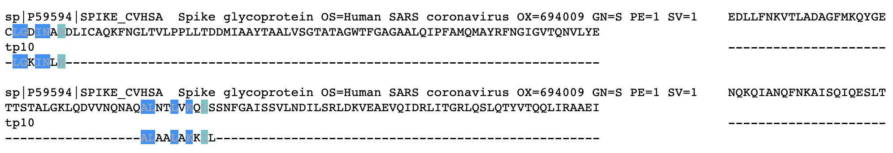

# covid19_msa
Covid-19 spike protein multiple sequence alignment python notebook.

Output snapshot:

This is a multiple sequence alignment of Covid 19 Spike Protein and Transportan 10 cell penetratint peptide.

**Credits:**

- [BioPython](https://biopython.org/)
- [pyMSA](https://github.com/benhid/pyMSA/blob/master/examples/runner.py)
- [Clustal Omega](https://www.ebi.ac.uk/Tools/msa/clustalo/)

